# Markdown 编辑器推荐

## 在线版

### 1. [dillinger](http://dillinger.io/)

漂亮强大，支持md, html, pdf 文件导出。支持dropbox, onedrive，google drive, github. 来自国外，可能不够稳定。

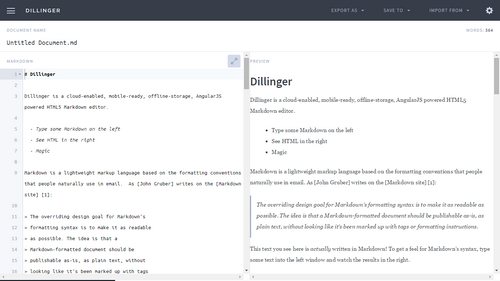

### 2. [StackEdit](https://stackedit.io/)

输出美观大方，可本地保存，还有拼写检查，但是对中文支持不好，可以从截图中看到，中文全部被标记为拼写错误，而且源代码中汉字的字间距太大。

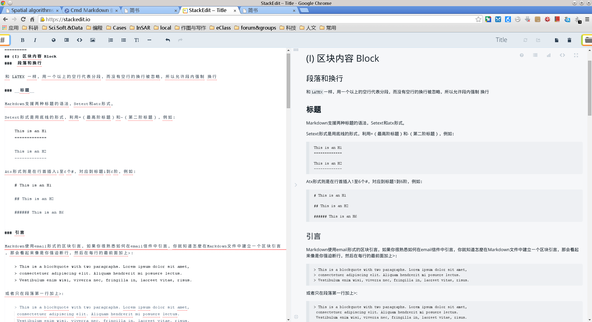

### 3. [MaHua](http://mahua.jser.me/)

小众软件推荐，界面有些简陋。

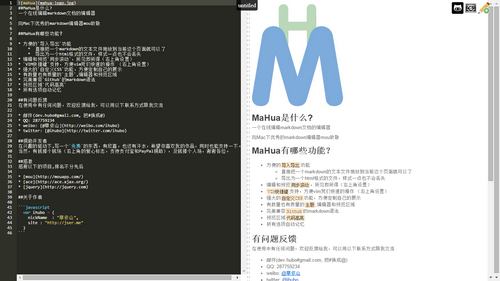

### 4. [简书](http://www.jianshu.com/)

一个很不错的博客平台，每几秒钟便会自动存入一个备份。可以直接从本地拖入照片生成链接，一直在不断优化。作为一个博客平台，需要注册账号后方能进行写作。

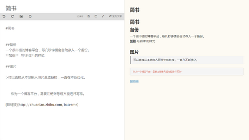

### 5. [马克飞象](https://maxiang.io/)

因为印象笔记不支持Markdown，而这款可以直接把文本存到印象笔记的编辑器对于重度印象笔记用户是个不错的选择。付费软件，可以免费试用。

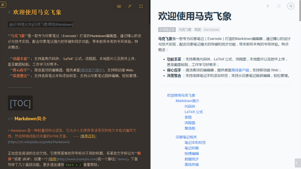

## windows

### 1. [MarkdownPad](http://markdownpad.com/)

用户可以通过键盘快捷键和工具栏按钮来使用或者移除 Markdown 格式。MarkdownPad左右栏的分割方式令用户可以实时看到 HTML 格式的 Markdown 文档。

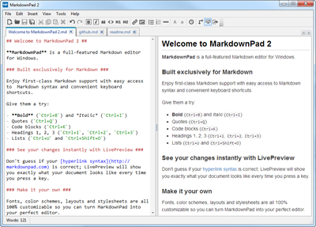

### 2. [MarkPad](http://code52.org/DownmarkerWPF/)

MarkPad 是款开源的 Markdown 编辑器，与 Window 8 风格和谐友好的界面，可以直接在你的博客或者 GitHub 中打开、保存文档，直接将图片粘贴到 Markdown 文档中。

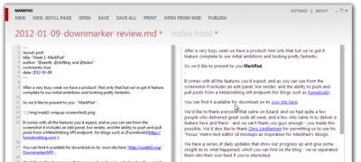

### 3. [Smark](http://git.oschina.net/elerao/Smark)

开源软件。

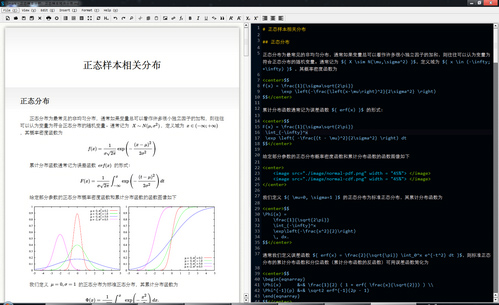

### 4. [Miu](http://www.appinn.com/miu-markdown-editor/)

一款模仿mou 的windows平台markdown编辑器，小众推荐，必属精品，官网无法打开，好在小众提供了百度云下载。界面美观，功能不够成熟

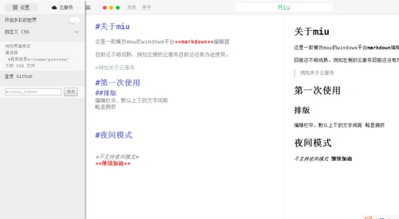

## OSX

### 1. [Mou](http://25.io/mou/)

Mou 是 Mac下杰出的 Markdown 编辑器，提供语法高亮、在线预览、同步滚动、全屏模式，支持自定保存、自动匹配，允许自定义主题，支持 CSS，HTML 和 PDF 导出等。

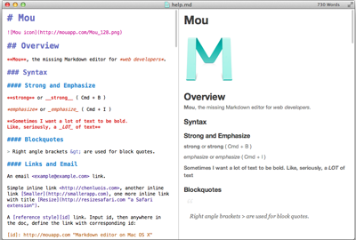

### 2. [MacDown](http://macdown.uranusjr.com/)

开源且免费。

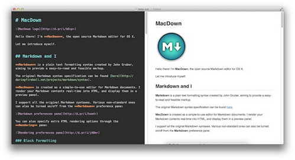

### 3. [Ulysses](http://www.ulyssesapp.com/)

支持OS X , iPad，售价 283元。堪称markdown编辑器中的佼佼者。

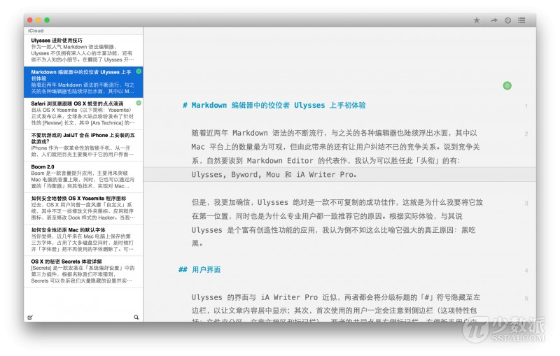

### 4. [iA Writer](https://ia.net/writer/ios)

支持OS X , iOS 及Android，未优化中文显示，售价68，pro版本128元。

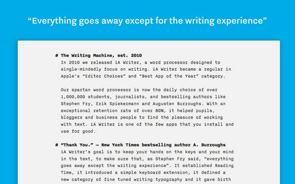

### 5. [MWeb](http://zh.mweb.im/)

专业的 Markdown 编辑器。UI漂亮，主题可选。支持markdown扩展语法，支持打字机滚动模式，支持发布到wp、blogger、tumblr等多个博客。

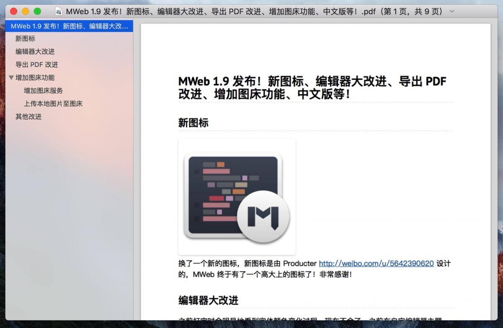

## 跨平台

### 1. [Cmd Markdown](https://www.zybuluo.com/mdeditor)

作业部落出品，也是一款不错的工具和博客平台兼顾的产品。全平台且提供web版。

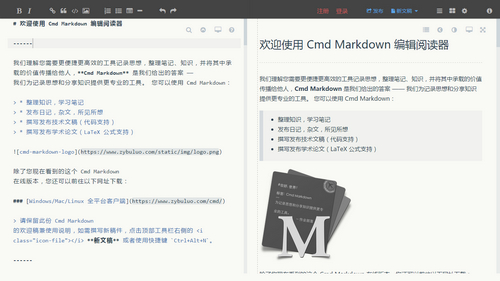

### 2. [小书匠编辑器](http://soft.xiaoshujiang.com/)

全平台覆盖并且有web版。

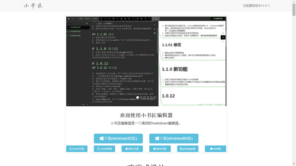

### 3. [FarBox](https://www.farbox.com/)

一个支持Markdown写作语法的博客平台，让用户通过Dropbox（现在默认是自己的同步服务器）直接建立个人网站。FarBox编辑器免费，支持多平台（无web版，Linux版停止维护），个人认为是Windows平台最优雅的编辑器。多说一句，Farbox服务可以免费试用，在本地编辑器内写作自动同步发布在个人博客，对像笔者这样希望有个人博客但却不愿折腾的小白来说，是个不错的选择。

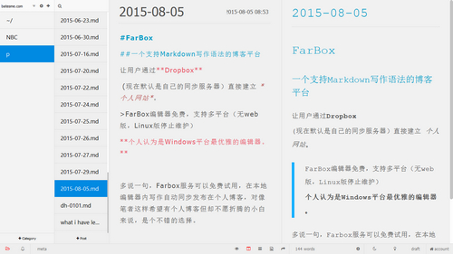

### 4. [Sublime Text 2](http://www.sublimetext.com/)

界面简约大方，定位专业。价格70美元，但是如果你能忍受时不时弹出的注册提醒，完全可以免费使用。唯一美中不足的是markdown并非其原生功能，需要安装插件。

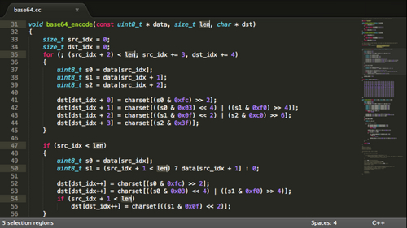

### 5. [Atom](https://atom.io/)

github出的编辑器，功能十分强大，除了编写代码之外还可以做为markdown编辑器，并且原生支持markdown预览，按`ctrl+shift+m`弹出。

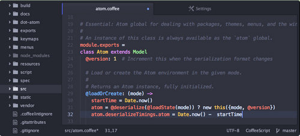

### 6. [ReText](http://sourceforge.net/p/retext/home/ReText/)

用python开发的，所以跨平台。ReText 是一个使用 Markdown 语法和 reStructuredText (reST) 结构的文本编辑器，编辑的内容支持导出到 PDF、ODT 和 HTML 以及纯文本，支持即时预览、网页生成以及 HTML 语法高亮、全屏模式，可导出文件到 Google Docs 等。

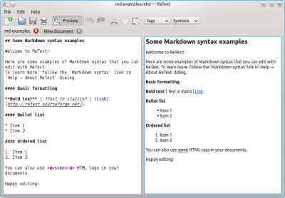

## 注

部分内容来自[月光博客 - 好用的Markdown编辑器一览](http://www.williamlong.info/archives/4319.html)。
