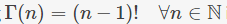
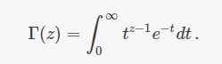
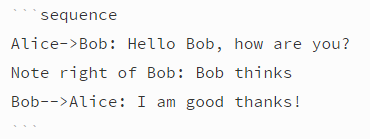
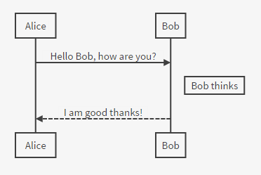
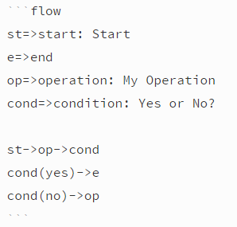
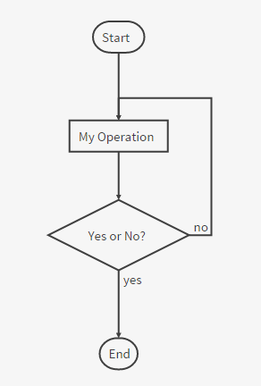

# Markdown 高级语法

只有少数编辑器支持，使用前请先确认。

## 定义列表

```
Term 1
Term 2
:   Definition A
:   Definition B
```

会被编译成

```
<dl>
<dd>Term 1</dd>
<dd>Term 2</dd>
<dt>Definition A<dt>
<dt>Definition A<dt>
</dl>
```

## 目录

通过`[TOC]`标记来插入目录。

在编辑器不支持`[TOC]`标记的情况下可以使用添加id的方法构建目录。

```
### Directory
* [1.Content one](#chapter1)
* [2.Content two](#chapter2)

### <span id="chapter1">1.Content one</span>

### <span id="chapter2">2.Content two</span>
```


## TeX公式

内联的TeX公式使用一个美元符号标记。

```
$\Gamma(n) = (n-1)!\quad\forall n\in\mathbb N$
```

会被编译成



TeX公式块用独占一行的两个美元符号来标记。

```
$$
\Gamma(z) = \int_0^\infty t^{z-1}e^{-t}dt\,.
$$
```

会被编译成



如果你的编辑器不支持这个功能，可以手动解决。首先引入mathjax脚本：

```
<script type="text/javascript" src="https://cdn.mathjax.org/mathjax/latest/MathJax.js?config=TeX-AMS_HTML"></script>
```

之后，在需要插入公式的地方使用`<script>`标签包裹公式：

```
<script type="math/tex">\Gamma(n) = (n-1)!\quad\forall n\in\mathbb N</script>

<script type="math/tex; mode=display">
\Gamma(z) = \int_0^\infty t^{z-1}e^{-t}dt\,.
</script>
```

TeX的语法参考请见[这里](http://meta.math.stackexchange.com/questions/5020/mathjax-basic-tutorial-and-quick-reference)。

## UML图

可以像这样来画uml时序图：





这是uml流程图：





时序图的语法请见[这里](http://bramp.github.io/js-sequence-diagrams/)。流程图的语法请见[这里](http://adrai.github.io/flowchart.js/)。
