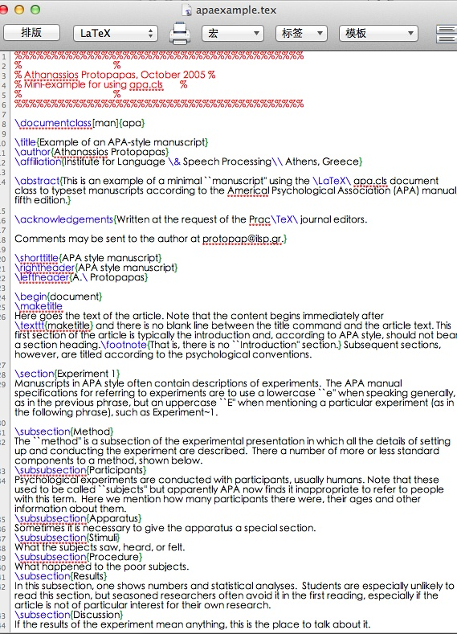
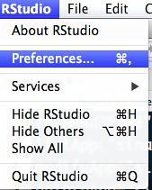
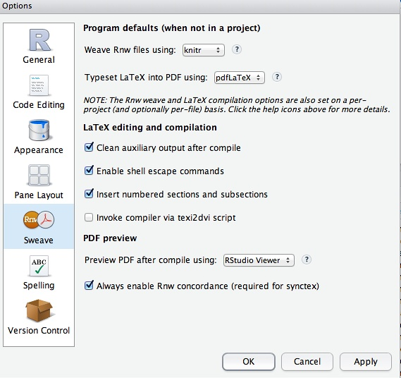
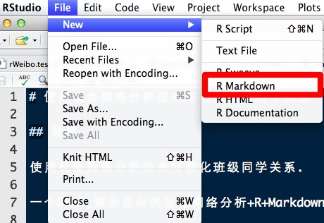
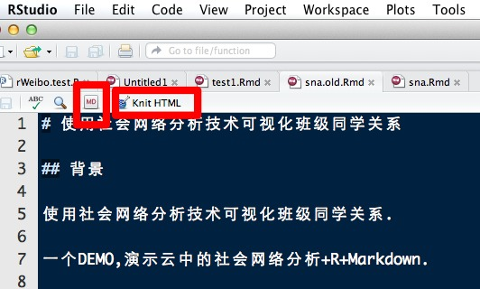
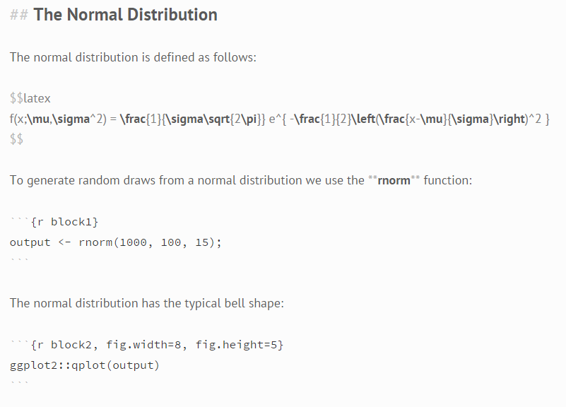
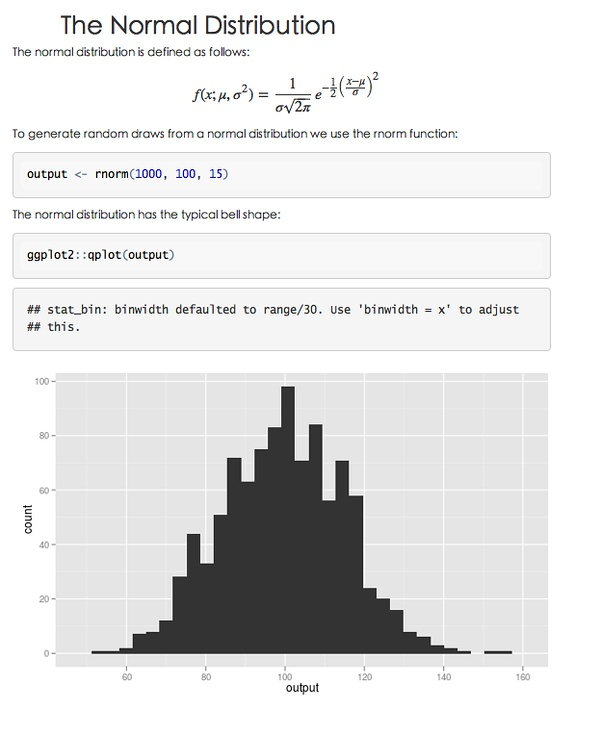

# Markdown + R

来源：[Markdown写作浅谈](http://www.yangzhiping.com/tech/r-markdown-knitr.html)

## 科技写作与Markdown+R

### 科技写作会碰到什么难题？

如果你是纯文科生，写的都是豆瓣小酸文或者诗歌之类的，那么，看完上面这一部分就可以打住了。如果你还有写科技论文的需要，则继续往下看。

科技写作与文艺写作的不同主要有：

*   公式与图表：相信各位写过科学论文的，都会为数学公式与各类图表的输出头疼不已；
*   格式转换：pdf是通用的，但是有时偏偏需要LaTeX原始格式或者Word原始格式；
*   参考文献：投稿给不同刊物，往往参考文献要根据对方的格式来调整。

解决这些难题，[LaTeX](http://en.wikipedia.org/wiki/LaTeX)是国际科学界，尤其是偏数理类的学科的主流方案之一。当然，因为中国盗版office的流行，导致国内科技论文Word更盛行，则是另一码事。Word因为近些年在参考文献协作软件、数学公式方面的发力，也逐步成为科技界认同的论文投递标准之一。

提到LaTeX的人们，常常有两种口气。一种是当做大神来敬仰的，当语言、软件变为传奇，路人皆知它的诞生历史时，于是，众多如你我这类文科生，只有抬头仰望的份了。另一类，则是不屑的口气，LaTeX那么好学，你怎么都学不会！国际期刊都是用这个写的，你别混了。。。

于是，我等文科生只好在被鄙视的眼光之下，快快走过LaTeX。。。但是，LaTeX真的符合人们写作习惯吗？请记住当时的历史。那时的计算机，所见即所得，并不像今天这么流行。那时的计算机，处理能力也不像今天这么强大。更别提什么脚本语言了。翻出上一份LaTeX文档所用的APA模版，大家就知道它有多么坑爹了。。。



使用Lyx，好看多了。问题是，它有坑吗？你跳过吗？

## Markdown+R如何解决的？

每位试图解决LaTeX的不便，又试图保留它的优点的人们，都走上了一条不归路。

直到有一天，极其熟悉LaTeX，也熟悉Markdown的yihui同学，意识到了，LaTeX它可以作为最终格式生成。但是，我们中间的写作过程，完全可以用Markdown这么简单明了的语法来写，我们真正需要的，就是一堆数学公式、图表与参考文献而已。前2者，恰恰是R的强项。后者，则留给开源社区，下一步解决。（可参考[线索1](http://johnmacfarlane.net/pandoc/README.html#reference-links)、[线索2](https://github.com/inukshuk/citeproc-ruby)、[线索 3](https://github.com/inukshuk/jekyll-scholar) )

于是，在他的新作R包[knitr](http://yihui.name/knitr/)中，果断提供了Markdown支持。并说服R社区主流编辑器厂家，开源软件[RStudio](http://www.rstudio.com/) 提供 Markdown支持，从而使得Rmd这种新格式开始流行。我们有幸看到这个重要格式的诞生，国人的贡献如此重要。

## Rmd 简介

Rmd 格式更详细的描述，读 yihui 的文档：[自动化报告](https://github.com/yihui/r-ninja/blob/master/11-auto-report.md)

在这里，让我简单说明，如何最快上手Rmd格式。

### 安装并配置RStudio

下载 [RStudio](http://rstudio.org/) 之后，打开配置选项，如下图所示：



然后，进行如下配置：



### 新建Rmd文档

新建一个Rmd文档，如下图所示：



然后，默认会出来一些内容。如果你对Markdown语法有不熟悉的地方，点击MD按钮。写完之后，直接点击： **Knit HTML** 按钮即可发布。MD按钮与Knit Html按钮的位置如下图所示：



就会预览成功。你也可以点击保存，生成相应的图片、Markdown文档。

是的，你要的一切图片都有了！这就是 yihui 所推崇的 文学性编程、[可重复研究](http://biostat.mc.vanderbilt.edu/wiki/pub/Main/UseR-2012/InvitedXieAllaire.pdf)概念的神奇。

更重要的是，还保留了对LaTeX的无缝兼容。比如，大家可以敲下这段文字：



其中，这一段，

```
$$latex
f(x;\mu,\sigma^2) = \frac{1}{\sigma\sqrt{2\pi}} e^{ -\frac{1}{2}\left(\frac{x-\mu}{\sigma}\right)^2 }
$$
```

就是直接生成LaTeX格式的数学公式！

没有安装RStudio，或者不熟悉R的朋友，可以在我搭建的一个在线演示APP里面，将上述代码，粘贴上去，然后看看神奇的效果！

网址是：[R Markdown App](http://r.psyapp.com/apps/markdown/) 效果如下图所示：



## 这么做，有什么好处呢？

让我细数一下：

### 真正意义上的可重复性研究

发表论文或者审核同事的报告，有个最麻烦的事情，你不知道他的步骤或者计算是否有误。现在，代码嵌在报告正文中，或者附录在报告末尾。而你，要做的，仅仅是一键生成。。。 这就是真正意义上的可重复性研究！

### 更强大的数学与制图能力

既兼容了LaTeX的既有能力，同时，又广泛借助于R自身强大的作图与统计学习能力。

更重要的是，未来，并不是非要用R语言作图。yihui 同学在前文中的描述已经极其清楚了。

### 当然，还有云计算

真正意义上的云计算，尤其是类似于我们这样，中小企业、小型实验室实战使用的小型云计算，不同于各类忽悠的云计算。Markdown+R这种方式是最佳方式之一。上述例子中提到的那个APP，就是搭建在云中。同时提供各类REST接口，可以被Ruby程序调用。

## Markdown格式与LaTeX、Word等格式的互转

点这里：[Pandoc](http://johnmacfarlane.net/pandoc/)

还有不少有趣的玩法，如[Building a beamer presentation with knitr](https://gist.github.com/2955183).

## 如何学习Markdown+R？

好了，回到大家最关心的部分。分成两部分，先是如何学习Markdown，其次是如何学习R。

### Markdown格式说明

*   参考：[Markdown](http://markdown.tw/)
*   更好的学习办法是直接读各类范本文件
*   更多资源参考[V2ex节点](http://v2ex.com/go/markdown)

### Markdown编辑器

*   Mac等平台下推荐[Mou](http://mouapp.com/)
*   Windows平台推荐[MarkdownPad](http://markdownpad.com/)
    RStudio可作为写作科技论文与R语言编辑器选择，它是跨平台的
*   [markdown-here](https://github.com/adam-p/markdown-here)借助Chrome插件，将gmai写作窗口变为Markdown在线写作窗口
*   可以直接在线通过github撰写与提交Markdown文件，github有自动的版本跟踪功能，不用担心写废与找不到以前写的

## Windows下的GitHub特别说明

*   如果碰到git、github等与windows不兼容的现象，不建议折腾，而是直接在线提交即可。
*   GitHub最近发行了Windows版本，下载地址[在这里](https://github.com/blog/1127-github-for-windows)
*   我的老文：[如何高效利用github](http://www.yangzhiping.com/tech/github.html)

## 如何学习R

### Rstudio

*   Getting_Started_with_RStudio.pdf

### R语言入门读物

*   R for SAS and SPSS Users.pdf ： 适合有SPSS基础的朋友
*   Analysis of Questionnaire Data with R ： 适合处理问卷数据的文科生或社会科学类
*   更多参考我的豆列：[技术派心理学](http://book.douban.com/doulist/1222833/)

## 示范

### 文艺青年

文艺青年看这里，

*   [為什麼文科生也該用markdown寫作?](http://www.douban.com/note/221187015/)
*   [为什么作家应该用 Markdown 保存自己的文稿](http://jianshu.io/p/qqGjLN)

### 科学青年

可以看这里：[如何学习科学：开放科学工具箱](https://github.com/ouyangzhiping/openscience/blob/master/README.md)

点击 RAW 即可看到原始格式。这是一个长文档的示范。另一个示范是作者写的一个在线DEMO：

[云中的社会网络分析+Markdown](http://r.psyapp.com/apps/markdown/)

以及：[Markdown+R科技文写作](http://panda0411.com/2012/06/22/markdownr%E7%A7%91%E6%8A%80%E6%96%87%E5%86%99%E4%BD%9C/)

### 技术青年

*   [knitr](http://yihui.name/knitr/)以及各类Google、维基百科。
*   特别是：[pandoc-markdown](http://johnmacfarlane.net/pandoc/README.html#pandocs-markdown)
*   [Primarily Pandoc: Writing in Markdown instead of LaTeX](http://www.charlietanksley.net/philtex/primarily-pandoc/)
